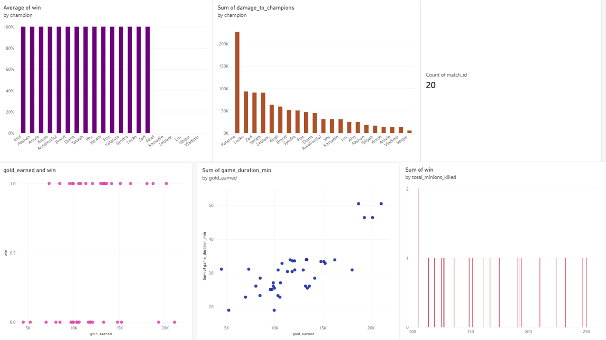

# Mid-Lane League Of Legends Advantage Tracker 🎮📊

## Overview
An automated End-to-End Data Pipeline (ETL) designed to extract, transform, and analyze live match telemetry from the League of Legends API. The project focuses on Mid-lane matchups to identify the correlation between resource generation (Gold, Minions) and match outcomes.

## Architecture & Tech Stack
* **Extract (API):** Automated fetching of raw JSON data using `requests` from the Riot Games Match-V5 API.
* **Transform (Python & Pandas):** Parsing nested JSON structures, filtering for Mid-lane participants, and calculating key metrics (e.g., Match duration in minutes).
* **Load (MySQL):** Pushing cleaned data directly into a local MySQL database utilizing `SQLAlchemy` and `PyMySQL`.
* **Automation:** Configured via Windows Task Scheduler for daily batch processing without manual intervention.
* **Visualization:** Power BI dashboard connected directly to the MySQL database to track real-time trends and KPIs.

## How it Works
The Python script is triggered daily. It fetches the latest 20 matches of a specified player, isolates the Mid-lane data for both teams, structures it into a Pandas DataFrame, and appends it to the `mid_matchups` SQL table. 

## Libraries Used
See `requirements.txt` for the full list of dependencies.

